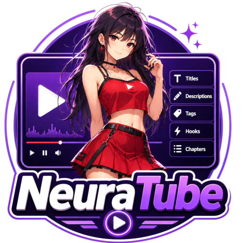

<p align="center">
  
</p>

An AI optimisation panel that runs **inside** YouTube Studio and on public YouTube pages.
It reads your video's real data from YouTube's own traffic — not by scraping the screen —
and turns it into titles, descriptions, tags, chapters, hooks and comments using **your own
API key**.

No telemetry. No credit system. No account required. Nothing leaves your browser except
the request you asked for, sent to the AI provider you chose.

```
Chrome 111+  ·  Manifest V3  ·  MIT licensed  ·  ~105 KB packed
```

---

## What makes it different

Most tools in this category read the page. NeuraTube reads the **payloads**.

When YouTube Studio loads your video, it fetches the canonical metadata over its own
internal API. NeuraTube intercepts those responses, so the model sees the title, description,
tags, duration, visibility and compliance flags exactly as YouTube holds them — not a
truncated copy scraped out of the DOM.

Three consequences that matter:

- **Tags on any public video.** A video's tags are not rendered anywhere in the page, at
  any point. They exist in YouTube's player payload, which is where NeuraTube reads them.
- **The full description**, not the fragment that ends in `…` before you click "more".
- **Chapters from real timestamps.** Chapter generation uses YouTube's own caption timings
  and **refuses to run without them**, because a guessed timestamp looks correct and is
  wrong at every point in the video.

---

## Features

### In YouTube Studio

| Task                         | What it does                                                                                                                                           |
| ---------------------------- | ------------------------------------------------------------------------------------------------------------------------------------------------------ |
| **Title optimizer**          | Five distinct titles, each individually copyable, each with a one-line rationale and a character count measured against what YouTube actually displays |
| **Description structurizer** | A description with the first two lines carrying the search weight, then structure below the fold                                                       |
| **Tag generator**            | A tag set inside YouTube's 500-character ceiling, copyable as one comma-separated block                                                                |
| **Chapters**                 | Timestamps read from YouTube's caption timings, never estimated                                                                                        |
| **Hook writer**              | Opening lines for the first fifteen seconds                                                                                                            |
| **Thumbnail text**           | Short overlay text that survives being shrunk to a sidebar thumbnail                                                                                   |
| **A/B title variants**       | Variants that differ on one axis, so a test result means something                                                                                     |
| **Translate metadata**       | Title, description and tags localised to chosen locales                                                                                                |

### On public watch pages and Shorts

| Task                   | What it does                                                                                                                      |
| ---------------------- | --------------------------------------------------------------------------------------------------------------------------------- |
| **Comment generator**  | Five comments a real viewer would leave, drawn from the transcript and the comments already posted — each one copyable on its own |
| **Comment insights**   | What the audience asked for that the video did not answer, with like counts as the priority signal                                |
| **Steal this video**   | What a competitor promises, why it works, how to beat it                                                                          |
| **Content gaps**       | Ranked gaps a channel has the authority to claim                                                                                  |
| **Better video ideas** | Stronger angles on this video, grounded in competitor context                                                                     |

Works on `/watch`, `/shorts/`, search results, and every Studio surface.

### Throughout

- **Four providers, one interface** — OpenAI, Anthropic, DeepSeek, NVIDIA NIM. Models are
  discovered live from each provider's `/models` endpoint, so nothing is hardcoded and
  nothing goes stale.
- **Per-task routing** with automatic fallback when a provider is rate limited.
- **A real cost meter** — tokens in, tokens out, and cost per run. It says "cost unknown"
  for a model it has no price for rather than inventing one.
- **Every prompt is editable.** They ship as text you can rewrite, and the panel tells you
  when your edit was written against an older default.
- **Studio compliance guardrails.** Made-for-kids, paid promotion, age restriction and
  altered-content flags become hard constraints on the request, so suggestions stay usable
  instead of being rejected after you paste them.
- **Transcript switch.** Where a transcript helps but is not required, a small toggle lets
  you include or exclude it per task — some auto-captions are worse than the metadata alone.
- **Per-task token limits.** Reasoning models stream their thinking before their answer and
  can spend an entire budget on it; the panel diagnoses that specifically and offers a
  one-click fix.
- **Draggable, resizable panel** with position remembered per surface, full keyboard
  support, and WCAG 2.1 AA contrast in both themes.

---

## Install

Not on the Chrome Web Store. Load it unpacked:

1. Download `neuratube-<version>-unpacked.zip` from
   [Releases](https://github.com/Akalanka1337/neuratube/releases) and extract it.
2. Open `chrome://extensions`.
3. Turn on **Developer mode** (top right).
4. Click **Load unpacked** and select the extracted folder — the one containing
   `manifest.json`.
5. Open the extension's **Options** and paste an API key from any one provider.
6. Visit a video in YouTube Studio. Press <kbd>Alt</kbd>+<kbd>N</kbd> if the panel is hidden.

One key is enough. Add more only if you want per-task routing or a fallback.

---

## Build the unpacked package yourself

You do not have to trust the release zip. Building it takes about a minute.

**Requirements:** [Node](https://nodejs.org) 22 or newer, and
[pnpm](https://pnpm.io/installation) (`npm install -g pnpm`).

```bash
git clone https://github.com/Akalanka1337/neuratube.git
cd neuratube
pnpm install
pnpm zip
```

That writes **`artifacts/neuratube-<version>-unpacked.zip`** — the same artifact the
releases contain. Extract it and load the extracted folder via **Load unpacked**, as above.

If you would rather load it directly without zipping:

```bash
pnpm build      # writes dist/
```

Then **Load unpacked** → select `dist/`.

For development, `pnpm dev` rebuilds on save. Chrome does not hot-reload extensions, so
after each change click the refresh icon on the NeuraTube card in `chrome://extensions`,
then reload the YouTube tab.

### Verify what you built

```bash
pnpm verify      # typecheck, lint, format, 574 unit tests, build, size budgets
pnpm e2e         # 164 Playwright tests against a mocked YouTube
```

`pnpm verify` is exactly what CI runs. Both should pass on a clean clone — if they do not,
that is a bug worth reporting.

---

## Your data

- **API keys live in `chrome.storage.local`** — never `chrome.storage.sync`, so they are
  never uploaded to your Google account. They are never logged, never included in an error
  message, and redacted in the diagnostics view.
- **Requests go from your browser straight to the provider you chose.** There is no
  NeuraTube server in the path, because there is no NeuraTube server.
- **Nothing is persisted that YouTube will hand over again.** Video metadata lives in
  memory for the page's lifetime. Transcripts are cached in `chrome.storage.session`, which
  never touches disk and is cleared when the browser closes.
- **Session credentials in intercepted traffic are never read.** YouTube's requests carry
  auth tokens (`eats`, `sessionInfo.token`, `onBehalfOfUser`). The parsers read only the
  descriptive fields, and tests assert that the rest cannot reach a log, a prompt or
  storage.

Full detail in [PRIVACY.md](PRIVACY.md).

---

## Free and premium — where the line is

**Everything described above is free, forever, and MIT licensed.** Bring your own key and
every task works.

A separate hosted service (NeuraTube Cloud) adds two things the extension cannot do on its
own:

|                  | Free (this repo)                     | Premium (hosted)                            |
| ---------------- | ------------------------------------ | ------------------------------------------- |
| All tasks        | ✅                                   | ✅                                          |
| Your own API key | Required                             | Not needed                                  |
| Prompts          | The ones in `src/prompts/`, editable | A tuned prompt library, applied server-side |
| Keyword research | —                                    | Search volume and real query intent         |

**Why premium is not a flag in this extension.** This code is public. Any check written
here could be deleted and the extension rebuilt in five minutes, with the instructions in
this very README. So there is no such check. Premium exists because the _work happens on a
server_ that requires a licence — the tuned prompts are never shipped in this bundle, and
the keyword data lives behind an API. That is an honest boundary rather than a lock, and it
is the only kind that survives being open source.

If you never buy anything, nothing here is crippled and nothing nags you.

> **Status:** the premium client is not built yet. The hosted service exists — licensing,
> packages, admin — but this extension does not yet talk to it.

---

## How it works

Four layers, deliberately separated:

```
MAIN world, document_start     src/intercept/
  Patches XMLHttpRequest and fetch to observe response bodies, and reads
  YouTube's own page globals. This is the only way to see response bodies
  under Manifest V3 — declarativeNetRequest cannot touch them, and
  webRequestBlocking is enterprise-only.

ISOLATED world, document_idle  src/panel/, src/state/
  The Shadow-DOM panel. Receives captures over a nonce-validated bridge,
  parses them, renders. Never on the page's critical rendering path.

Service worker                 src/entrypoints/background.ts
  Owns provider calls, streaming, the transcript cache and cost booking.
  Survives its own 30-second termination with a heartbeat.

Options page                   src/entrypoints/options/
  Keys, models, routing, prompts, usage, privacy, advanced limits, about.
```

The interceptor and the panel are separate worlds on purpose: the interceptor needs the
page's JS heap to patch its network functions, and the panel needs extension APIs the page
must never reach.

---

## Contributing — developers wanted

**This project is meant to be built with other developers, and there is real work
available.** If you want to help, here is the shortest path in:

1. **Browse the [Issues](https://github.com/Akalanka1337/neuratube/issues).** Features and
   enhancements worth building are filed there. Anything labelled
   [`good first issue`](https://github.com/Akalanka1337/neuratube/labels/good%20first%20issue)
   is scoped to be a self-contained first contribution.
2. **Comment on the issue** saying you are picking it up, so two people do not build the
   same thing.
3. **Fork the repo**, branch (`feat/comment-templates`, `fix/shorts-navigation`), and build
   it.
4. **Run `pnpm verify` and `pnpm e2e`** before you push. Both pass on `main`, so a failure
   is something your change introduced.
5. **Open a pull request** describing what you changed and why. Add a test that fails before
   your change and passes after.

Have an idea that is not filed yet? **Open an issue first** and describe it. It is a
five-minute conversation that can save you an afternoon building something that does not
fit — and most ideas do fit.

**Bug reports are just as valuable as code.** YouTube changes its internal payloads without
notice, and a capture from a page where something broke is the single most useful thing you
can send.

**Read [CONTRIBUTING.md](CONTRIBUTING.md)** for development setup, project layout, how to
add a task or a provider, and the conventions the codebase holds to — each one exists
because breaking it caused a real bug.

### Reporting a broken parser

When a parser stops matching, the panel prints a diagnosis line naming the endpoint, the
byte count and the field that moved. Paste that line into the issue.

**Redact your session first.** Never include `eats`, `sessionInfo.token`,
`clientScreenNonce`, `onBehalfOfUser`, or your channel id.

### Contributors

- **[@Akalanka1337](https://github.com/Akalanka1337)** — author and maintainer

Open a PR and add yourself.

---

## Credits

Sponsored by **[cyberscap.com](https://cyberscap.com)**.

---

## License

[MIT](LICENSE) © 2026 Akalanka Ekanayake

Use it, fork it, ship it, sell it. If you build something with it, a link back is
appreciated but not required.

### Not affiliated with YouTube

NeuraTube is an independent project, not affiliated with, endorsed by, or sponsored by
YouTube or Google. It reads data YouTube already sent to your own browser, in your own
authenticated session, and sends nothing to third parties other than the AI provider you
configure.

It relies on YouTube's internal endpoints, which are undocumented and can change without
warning. When they do, the panel says so specifically rather than showing you wrong data —
but expect the occasional broken release, and please report it.
